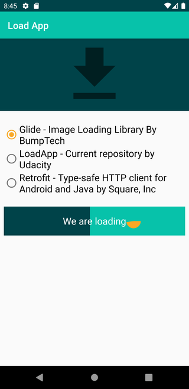
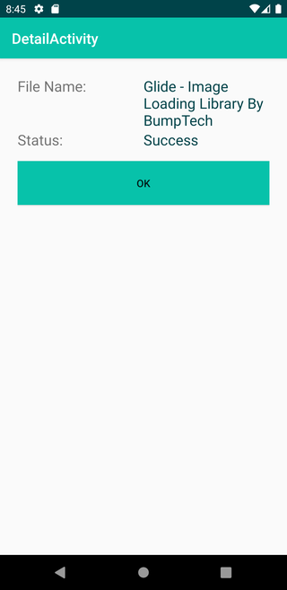

# Loading App

## About this Project

The idea of the App is:

_"Allow the user to download files and be notified at the end"._

## Why?

This project is part of my personal portfolio, so, I'll be happy if you could provide me any feedback about the project, code, structure or anything that you can report that could make me a better developer!

Email-me: harrisonhenrisn@gmail.com

Connect with me at [LinkedIn](https://linkedin.com/in/harrison-henri-dos-santos-nascimento-a6ba33112).

Also, you can use this Project as you wish, be for study, be for make improvements or earn money with it!

It's free!

## Functionalities

- File's list to donwload



- Notify the user 


- Navigate the user to details screen 



## Install

Clone the repo and open with [Android Studio](https://developer.android.com/studio?hl=pt&gclid=CjwKCAjwx6WDBhBQEiwA_dP8rfJ1IFHK0ldtDTs7g4jWKDGx9_sbmGEEMrQ00hjZa5X4RCTPMFRS0RoCSj0QAvD_BwE&gclsrc=aw.ds)

```
$ git clone https://github.com/HarrisonHenri/load-app
```

## Built With

* [Notification](https://developer.android.com/guide/topics/ui/notifiers/notifications)

## Contributing

You can send how many PR's do you want, I'll be glad to analyse and accept them! And if you have any question about the project...

Email-me: harrisonhenrisn@gmail.com

Connect with me at [LinkedIn](https://linkedin.com/in/harrison-henri-dos-santos-nascimento-a6ba33112).

Thank you!
